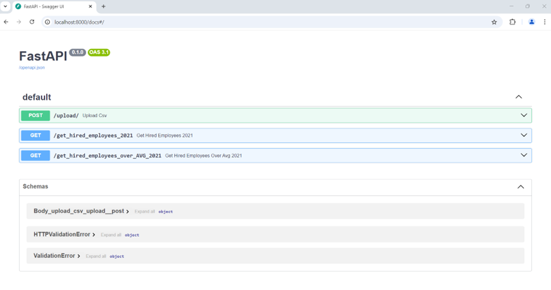
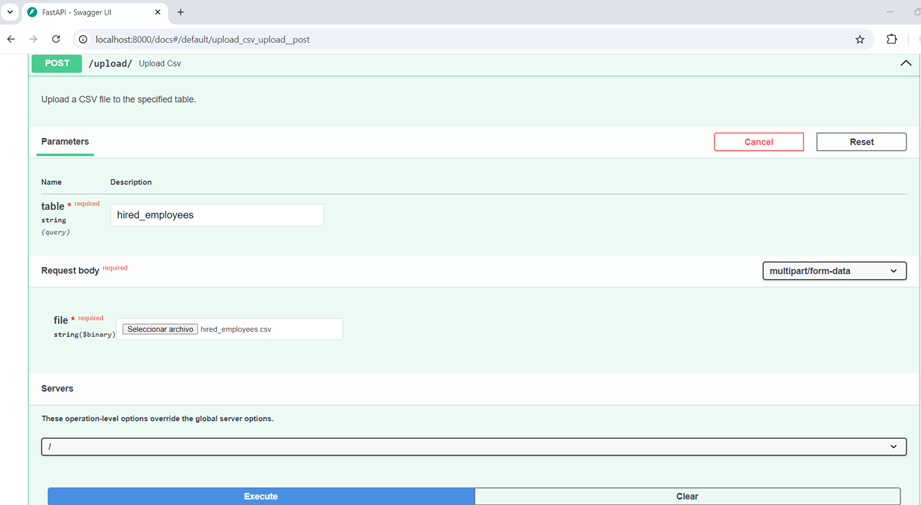
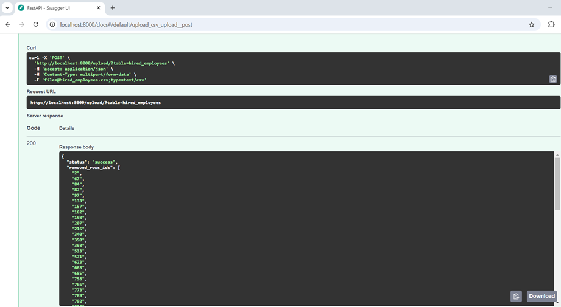
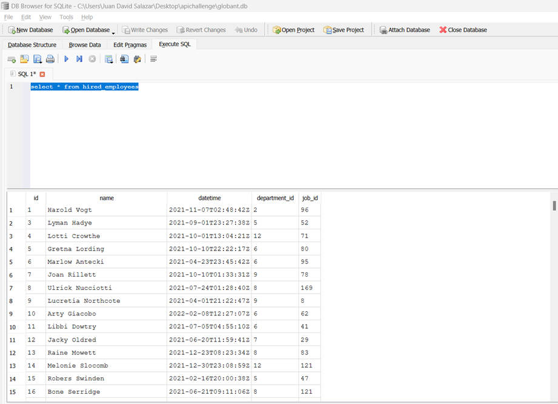
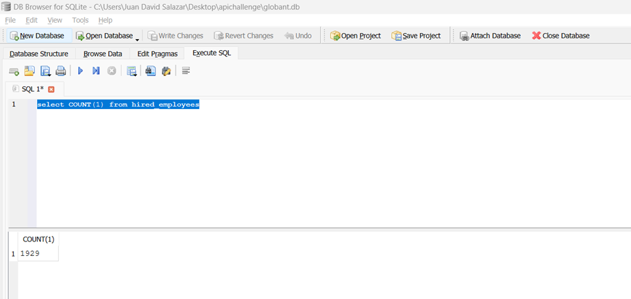
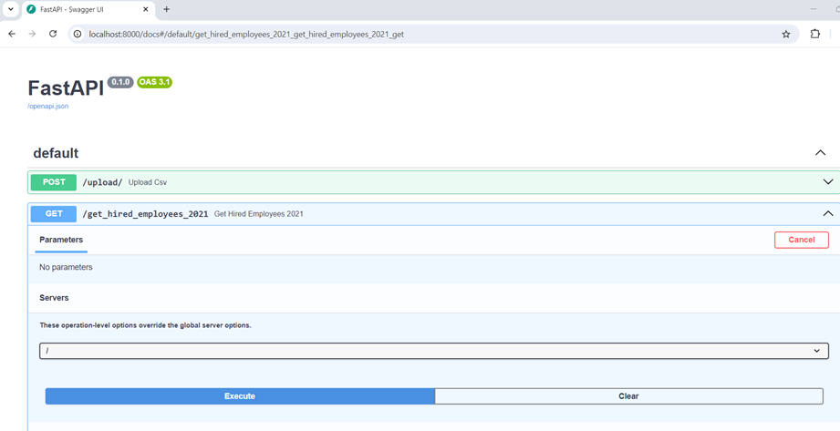
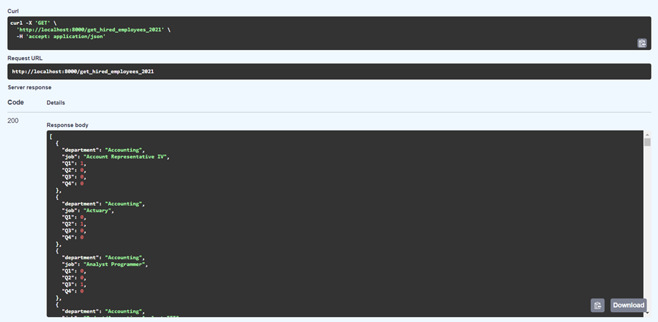
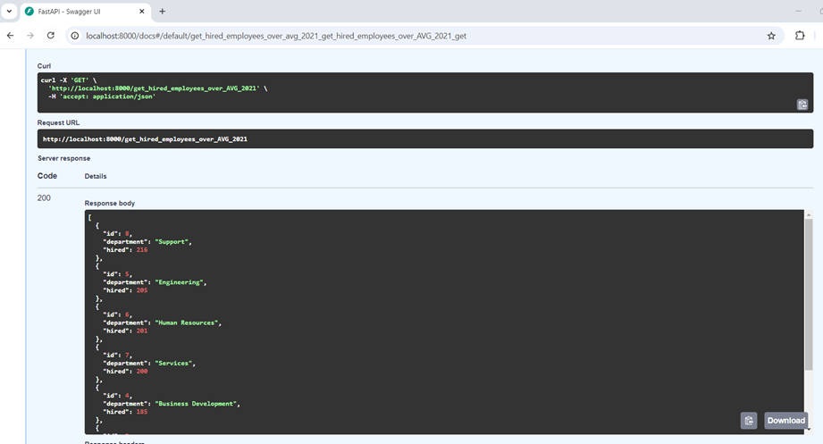

## fastapi-data-migration

# Overview of API Functionality and Features

This Local REST API is created in the context of data migration to accomplish:
1. Receive historical data from CSV files
2. Upload these files to a new DB
3. Be able to insert batch transactions (1 up to 1000 rows) with one request
4. Use queries to return: 
    4.1 Number of employees hired for each job and department in 2021 divided by quarter. The
table must be ordered alphabetically by department and job
    4.2   List of ids, name and number of employees hired of each department that hired more
employees than the mean of employees hired in 2021 for all the departments, ordered
by the number of employees hired

# Challenge development framework 

FastAPI - Modern, high-performance web framework for building APIs
Uvicorn - ASGI server for running FastAPI applications
SQLite - Lightweight, disk-based database used for development and testing
SQLAlchemy - ORM for database interactions
Python - programming language for development.

Note:Local REST API 

# Repositorie content 

| **File/Folder**                      | **Description**                                                   |
|-------------------------------------|-------------------------------------------------------------------|
| `main.py`                           | The entry point of the FastAPI application.                       |
| `db/session.py`                     | Contains database setup and SQLite interactions.                  |
| `db/models.py`                      | Defines the database models.                                      |
| `queries.py`                        | Queries used for the endpoints.                                   |
| `globant.db`                        | SQLite database file used in the project.                         |
| `historical_data/`                  | Folder where CSV files are uploaded.                              |
| `fastapi-env/`                      | Virtual environment setup.                                        |
| `Globant’s Data Engineering Coding Challenge.pdf` | PDF file with challenge description.                        |

# Available Enpoints
/upload_csv: Upload a CSV file to the specified table in DB ( name of the table must be specified )
/get_hired_employees_2021: Number of employees hired for each job and department in 2021 divided by quarter
//get_hired_employees_over_AVG_2021: List of ids, name and number of employees hired of each department that hired more
employees than the mean of employees hired in 2021 for all the departments

# How to use the app

FastAPI povides an automatic interactive API documentation in wich you can use the app: 

http://localhost:8000/docs#/

# Section 1 Use of upload_csv

Results 

# Section 2  Use of get_hired_employees_2021

Results 

# Section 2  Use of get_hired_employees_over_avg_2021
Results

# Documentation 

https://docs.python.org/3/library/venv.html
https://fastapi.tiangolo.com/

